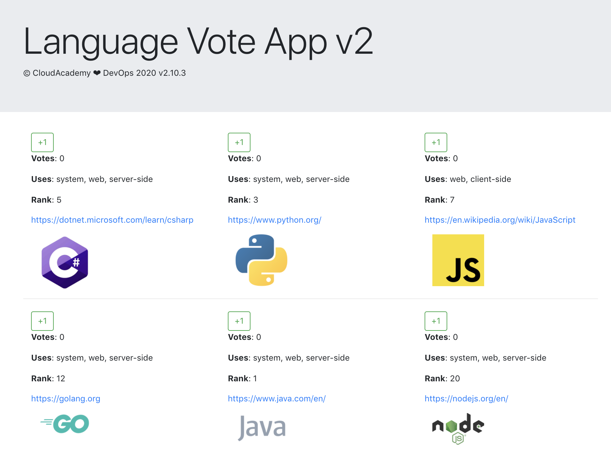
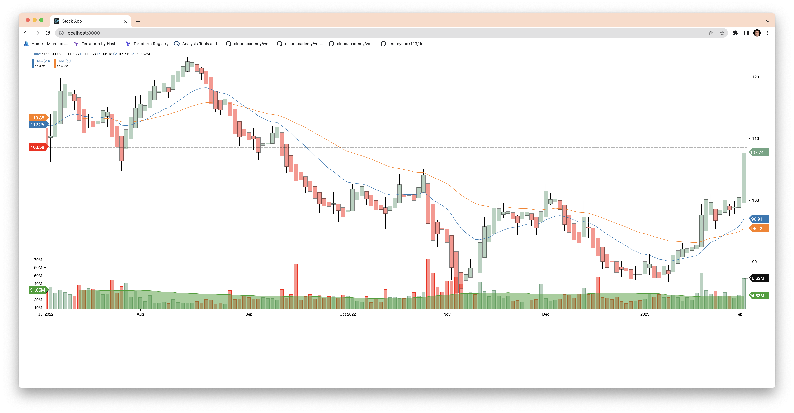
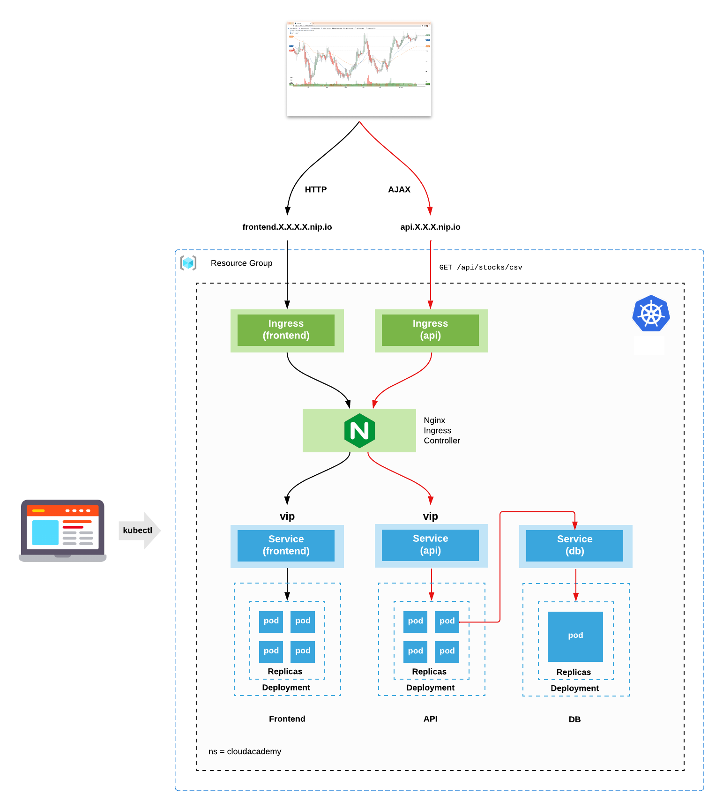

# CloudAcademy Terraform 1.x AWS Course
This directory contains example Terraform configurations for building AWS infrastructure.  This was taken from a CloudAcademy Terraform 1.x AWS Course and the original can be found https://img.shields.io/github/v/release/cloudacademy/terraform-aws

I have modified this collection.  In some cases I have removed exercises that I found less relavent or incomplete.  Due to this, the exercise numbering my vary.  Additionally, we may modify the exercises over time so they likely will become increasingly different.

## AWS Exercises
The each directory contains a different AWS infrastructure provisioning exercises. 

### Exercise 1
Create a simple AWS VPC spanning 2 AZs. Public subnets will be created, together with an internet gateway, and single route table. A t3.micro instance will be deployed and installed with Nginx for web serving. Security groups will be created and deployed to secure all network traffic between the various components.

https://github.com/docnetwork/infra-katas/tree/main/terraform/cloudacademy%20series/exercise1

### Exercise 2
Create an advanced AWS VPC spanning 2 AZs with both public and private subnets. An internet gateway and NAT gateway will be deployed into it. Public and private route tables will be established. An application load balancer (ALB) will be installed which will load balance traffic across an auto scaling group (ASG) of Nginx web servers. Security groups will be created and deployed to secure all network traffic between the various components.

https://github.com/docnetwork/infra-katas/tree/main/terraform/cloudacademy%20series/exercise2

### Exercise 3
Same AWS architecture as used in Exercise 2. This exercise demonstrates a different Terraform technique, using the Terraform "count" meta argument, for configuring the public and private subnets as well as their respective route tables.

https://github.com/docnetwork/infra-katas/tree/main/terraform/cloudacademy%20series/exercise3

### Exercise 4
Create an advanced AWS VPC to host a fully functioning cloud native application.

The VPC will span 2 AZs, and have both public and private subnets. An internet gateway and NAT gateway will be deployed into it. Public and private route tables will be established. An application load balancer (ALB) will be installed which will load balance traffic across an auto scaling group (ASG) of Nginx web servers installed with the cloud native application frontend and API. A database instance running MongoDB will be installed in the private zone. Security groups will be created and deployed to secure all network traffic between the various components.

For demonstration purposes only - both the frontend and the API will be deployed to the same set of ASG instances - to reduce running costs.

https://github.com/docnetwork/infra-katas/tree/main/terraform/cloudacademy%20series/exercise4

### Exercise 5
Launch an EKS cluster and deploy a pre-built cloud native web app.

The following EKS architecture will be provisioned using Terraform:

https://github.com/docnetwork/infra-katas/tree/main/terraform/cloudacademy%20series/exercise5

### Exercise 6

An example of using the [Terraform CDK](https://developer.hashicorp.com/terraform/cdktf) and [TypeScript](https://www.typescriptlang.org/) to codify and provision new AWS infrastructure (VPC, Subnet, SecurityGroup, EC2 Instance).

https://github.com/docnetwork/infra-katas/tree/main/terraform/cloudacademy%20series/exercise6
