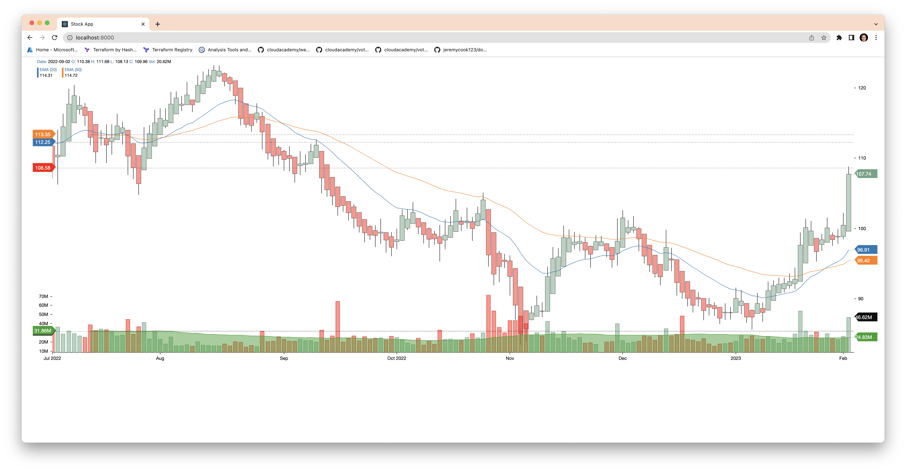

## Exercise 5
Launch an EKS cluster and deploy a pre-built cloud native web app.



The following EKS architecture will be provisioned using Terraform:


The cloud native web app that gets deployed is based on the following codebase:

- https://github.com/cloudacademy/stocks-app
- https://github.com/cloudacademy/stocks-api

The following public AWS **modules** are used to launch the EKS cluster:

- [VPC](https://registry.terraform.io/modules/terraform-aws-modules/vpc/aws/latest)
- [EKS](https://registry.terraform.io/modules/terraform-aws-modules/eks/aws/latest)

Additionally, the following **providers** are utilised:

- [hashicorp/helm](https://registry.terraform.io/providers/hashicorp/helm/latest)
- [hashicorp/null](https://registry.terraform.io/providers/hashicorp/null/latest)

The EKS cluster will be provisioned with 2 worker nodes based on m5.large **spot** instances. This configuration is suitable for the demonstration purposes of this exercise. Production environments are likely more suited to **on-demand always on** instances.

The cloud native web app deployed is configured within the `./k8s` directory, and is installed automatically using the following null resource configuration:

```terraform
resource "null_resource" "deploy_app" {
  triggers = {
    always_run = "${timestamp()}"
  }

  provisioner "local-exec" {
    interpreter = ["/bin/bash", "-c"]
    working_dir = path.module
    command     = <<EOT
      echo deploying app...
      ./k8s/app.install.sh
    EOT
  }

  depends_on = [
    helm_release.nginx_ingress
  ]
}
```

The Helm provider is used to automatically install the Nginx Ingress Controller at provisioning time:

```terraform
provider "helm" {
  kubernetes {
    host                   = module.eks.cluster_endpoint
    cluster_ca_certificate = base64decode(module.eks.cluster_certificate_authority_data)

    exec {
      api_version = "client.authentication.k8s.io/v1beta1"
      command     = "aws"
      args        = ["eks", "get-token", "--cluster-name", module.eks.cluster_name]
    }
  }
}

resource "helm_release" "nginx_ingress" {
  name = "nginx-ingress"

  repository       = "https://helm.nginx.com/stable"
  chart            = "nginx-ingress"
  namespace        = "nginx-ingress"
  create_namespace = true

  set {
    name  = "service.type"
    value = "ClusterIP"
  }

  set {
    name  = "controller.service.name"
    value = "nginx-ingress-controller"
  }
}
```
